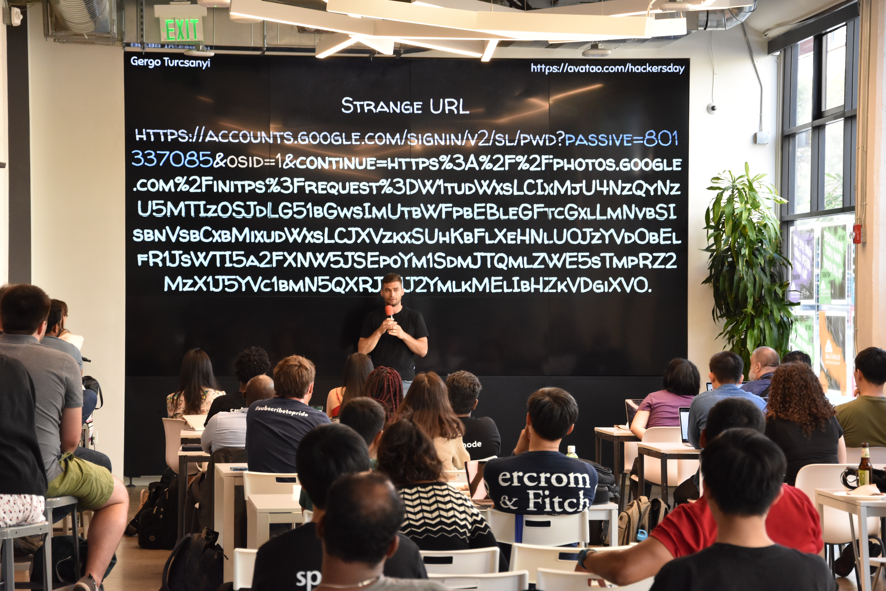
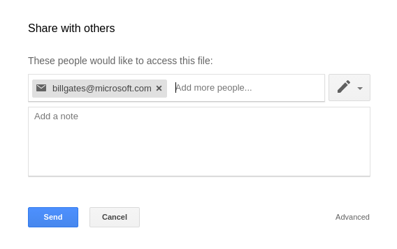
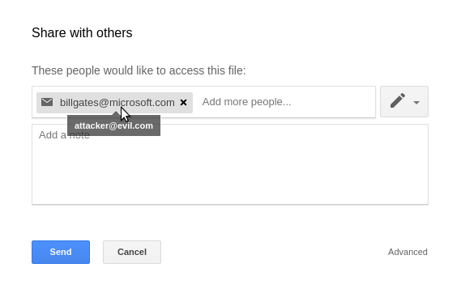

#### Introduction

IT security is a really huge topic and until you find your first bug you can't be sure that you have the required amount of knowledge, luck, and patience. Joining the club of bug bounty hunters as a newbie is hard, so let me share my first three bug bounty writeups.

#### Invite Spoofing

I found my first bug accidentally by trying to share a Google Spreadsheet with a teacher. (Un)fortunately, I sent the invite to his non-Gmail address and then e-mailed him the link. 

Naturally, he couldn't access it... Luckily Google tries to be helpful, so when you try to open a document that is not shared with you there is a **"Request access"** button below the error message, which sends an e-mail to the owner including a link like this:

*https://docs.google.com/spreadsheets/d/cmFuZG9t_c3ByZWFkc2hlZXQ_aWQ/edit?usp=sharing_erp&userstoinvite=billgates@microsoft.com*

If you open the link above as owner, the document will load and a **"Share with others"** modal pops up prefilled with the e-mail address from the URL:



My first thought was 

> *Hmm.. The user input is reflected in the DOM - should I try XSS?*

But my second thought instantly followed the first

> *There's no way I'm the first one who found it. This is Google and there are lots of smarter guys in the world who're constantly trying to hack it. I won't waste my time with XSS payloads...*

You can call me a pessimist, but I have read some recent posts about Google XSS vulnerabilities and they're much harder to find. However, something else caught my attention... 

The name of the parameter was `userstoinvite` instead of `usertoinvite` (notice the `s`), which means it can be used to invite more users at once - right?

I started playing with this parameter and it wasn't hard to figure out that if I separate the email addresses with commas, they will appear in the form. Just like when you want to send an email to multiple recipients... 

Okay, so if it works like writing email addresses, then let's see what happens if I specify a name:


*https://docs.google.com/spreadsheets/d/cmFuZG9t_c3ByZWFkc2hlZXQ_aWQ/edit?usp=sharing_erp&userstoinvite=Bill&nbsp;Gates&lt;billgates@microsoft.com&gt;*

It worked as I expected - the name was shown in the form instead of the address and the real email address behind the name was only displayed if you moved your mouse over it.

**What could go wrong?**

If you use a fake email address instead of a name, you can craft a spoofed invite URL and trick inexperienced users into giving you access. 



An attack scenario: 
- You're no longer working for a company and your access to an important spreadsheet is revoked, but you still have the URL (e.g. in your browser history) 
- Send a spoofed invite link to the secretary/accountant with your ex-bosses email address 
- Wait until they open the link and give you access

Timeline:
* 2017.10.03 - Bug reported 
* 2017.10.03 - Bug verified by a security engineer (P4 -> P3) 
* 2017.10.10 - $500 bounty awarded 
* 2018.01.16 - Bug fixed

## Getting Pictures From Your Drive

After my first bug, I had mixed feelings. 
 * On the one hand, I was very happy because I had found a security issue in Google and I appreciated the bounty as well. 
 * On the other hand, I wasn't really proud, because anyone who ever sent an email, could have found the bug with some luck - so at this point, I felt I could do better.

**But where to start?** 

I think I have a good understanding of web security concepts (like SOP and CORS) and since I'd fallen in love with the Chrome Dev Tools, I decided to start looking for insecure API endpoints and/or sensitive data in JS files.

My strategy was simple

```js
for webapp in google_webapps:
  devtools.open()
  devtools.select_tab('network')
  for button in webapp:
    button.click()
  for request, response in network_tab:
    request.analyze_manually()
    response.analyze_manually()
```

Also, it was long and boring. I spent afternoons and nights reading the requests and responses without success. I don't even remember how many different things I'd tried: 

> Maybe there are some vulnerabilities in this CSS... or how about these fonts?

> Ok, what if I resend this request with my other account's cookies?

> Hmm, I can upload an SVG here - let's try XSS!

I focused on Drive and the Google Docs family because:
 * They are connected (Docs has access to your files)
 * They are popular (so a security flaw would mean a serious threat)
 * They have many features and settings
 
The first thing I observed is Slides is similar to Docs and Sheets, but it uses a different (*legacy?*) API in some cases. For example, inserting an image from my drive triggered these requests:

```bash
curl 'https://docs.google.com/presentation/d/pReS3nTaT10N_1D/copyimages?id=bG9s_Y2hlY2tvdXR0aGlz_dDY4UkV1MEh3Qnc' --data 'photo=bG9s_Y2hlY2tvdXR0aGlz_dDY4UkV1MEh3Qnc'

{"bG9s_Y2hlY2tvdXR0aGlz_dDY4UkV1MEh3Qnc": "MDRjYWVhO-QtYjc0Ny00NDdkLWJlODctZ-VmNzVkOTI1YTkw"}
```

```bash
curl 'https://docs.google.com/presentation/d/pReS3nTaT10N_1D/renderdata?id=bG9s_Y2hlY2tvdXR0aGlz_dDY4UkV1MEh3Qnc' --data 'cosmoId=MDRjYWVhO-QtYjc0Ny00NDdkLWJlODctZ-VmNzVkOTI1YTkw'

{"r0": "https://lh6.googleusercontent.com/dmVyeXZlcnl2ZXJ5dmVyeXZlcnl2ZXJ5dmVyeXZlcnl2ZXJ5dmVyeXZlcnl2ZXJ5dmVyeXZlcnl2ZXJ5dmVyeXZlcnl2ZXJ5dmVyeXZlcnl2ZXJ5bG9uZ3N0cmluZw"}
```

Notice that the first response basically contains `"ID_OF_THE_IMAGE": "SOME_RANDOM_ID"`, and `"SOME_RANDOM_ID"` appears in the second request as the value of `cosmoId`. Also, the second response contains a direct link to the image.

These requests looked suspiciously weird - that's why I thought Slides had some legacy parts worth focusing on. So I replayed those requests above with different cookies and **boom it worked.**

Authorization was missing from these endpoints, so with a valid Google session, you could get **a direct URL of `any` picture from `any` drive** (if you have the ID of the file).

It sounds pretty serious, but the truth is that these image IDs are very long, case-sensitive strings. That's why I can't foresee scary attack scenarios, which also explains the relatively low bounty for this **Direct Object Reference** vulnerability.

Timeline: 
* 2017.11.27 - Bug reported 
* 2017.12.09 - Bug verified by a security engineer (P3 -> P1) 
* 2018.01.09 - $500 bounty awarded 
* 2018.01.16 - Bug fixed

## Please Login To Give Me Your Photos

On my first run I forgot about Google Photos somehow, so this time I started the bug hunting by focusing on it, using my well-proven strategy.

Nothing notable on the Network tab, but the **shared libraries** feature looked promising, since it lets you automatically share photos with a partner. 

If you want to set up a partner account you must enter an email address and a small popup window appears with a Google login screen. After entering your credentials and logging in, your photos will be automatically shared and you will be redirected to a page that only contains a general **Success message** and a **Close window** button. 

The size of the popup prevented me from seeing the whole URL, so I copied it to the Notepad for further research:


*// URL before login*

*https://accounts.google.com/signin/v2/sl/pwd?passive=801337085&osid=1&continue=https%3A%2F%2Fphotos.google.com%2Finitps%3Frequest%3DW1tudWxsLCIxMjU4NzQyNzU5MTIzOSJdLG51bGwsImUtbWFpbEBleGFtcGxlLmNvbSIsbnVsbCxbMixudWxsLCJXVzkxSUhKbFlXeHNlU0JzYVd0bElfR1JsWTI5a2FXNW5JSEpoYm1SdmJTQmlZWE5sTmpRZ2MzX1J5YVc1bmN5QXRJR1J2YmlkMElIbHZkVDgiXV0`.`*

*// URL after login*

*https://photos.google.com/initps?request=W1tudWxsLCIxMjU4NzQyNzU5MTIzOSJdLG51bGwsImUtbWFpbEBleGFtcGxlLmNvbSIsbnVsbCxbMixudWxsLCJXVzkxSUhKbFlXeHNlU0JzYVd0bElfR1JsWTI5a2FXNW5JSEpoYm1SdmJTQmlZWE5sTmpRZ2MzX1J5YVc1bmN5QXRJR1J2YmlkMElIbHZkVDgiXV0`.`*

It was clear that the `continue` parameter contained the second URL encoded, but the value of `request` - at first glance - was just a bunch of random characters and a dot at the end. 

If it was an equal sign, `request` could have been a valid **base64** encoded string, because the charset was the same... So I changed it, pasted the string into a **base64** decoder and it worked:

```
[
    [
        null,
        "12587427591239"
    ],
    null,
    "partner_account@email.com",
    null,
    [
        2,
        null,
        "WW91IHJlYWxseSBsaWtlI_
        GRlY29kaW5nIHJhbmRvbSBiYXNlNjQgc3_
        RyaW5ncyAtIGRvbid0IHlvdT8"
    ]
]
```

 * So I've changed the email to my address
 * **Base64** encoded the payload
 
After opening this crafted URL and logging in with my second account, the photos were shared with the first account. 

The best part is that I didn't even get a warning, notification or email about the partner account setup - it just happened.

By sharing this crafted URL I could've stolen the photos of anyone who opens it and enters their credentials on a genuine Google login page.

Timeline: 
* 2018.05.12 - Bug reported 
* 2018.05.14 - Bug verified by a security engineer (P4 -> P1) 
* 2018.05.22 - $3133.70 bounty awarded 
* 2018.08.22 - Bug fixed