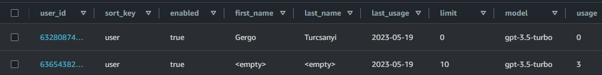
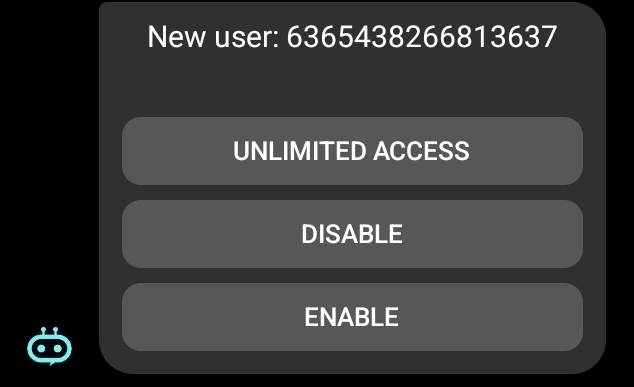
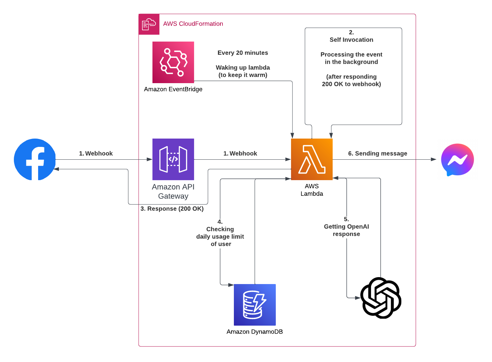

#### Introduction

Trying ChatGPT for the first time was truly an amazing experience for me. I've spent some weeks talking to it a few hours a day and had lots of fun. 

If you're reading this, then you're probably a technical person who also tried it and thinks it's cool, however, most of my friends and family members were just like:

> Meh... AI is a popular buzzword for years... why should I start caring about it now?

without actually giving ChatGPT a chance.

I kinda understand it, because honestly in our fast-paced world, we rarely have the patience to:
 * Registering to new applications (especially without proper motivation)
 * Opening the browser
 * Trying to log in and hoping the servers have the capacity for us
 * Asking our questions and waiting for an answer

So I thought removing the first three steps would make it easier for them and that's how I came up with the idea of integrating **ChatGPT** into **Messenger**. 

It's pretty self-evident and there were already [existing solutions](https://zapier.com/apps/facebook-messenger/integrations/chatgpt){:target="_blank"}, but I wanted to do it my way, because:
 * It was a nice hobby project (and blog post material)
 * I wanted to avoid any limitations that these third-party services might have
 * This way I can support and maintain the project

#### The Original Plan

 1. Creating a Facebook page
 2. Adding a Webhook
 3. Invoking an AWS Lambda
 4. Requesting the OpenAI API
 5. Responding to the user using the Facebook Messenger API

Since I work with AWS on a daily basis, implementing the core functionality was pretty simple, plus both Facebook and OpenAI provided well-written API documentations. 

However, despite the initial successes, there were also some less fun parts...

#### Issue #1

I'm not sure if it's common knowledge, but for me, it was surprising that Facebook does not let you use their APIs and Webhooks without (manually) reviewing and testing your app. 

My chatbot worked perfectly in development mode, but making it publicly available took a considerable amount of extra time.

#### Issue #2

 * **Facebook** expects a `200 OK HTTPS` response to the webhook events within `5` or less seconds - *otherwise repeats the request multiple times until getting a proper response*
 * **OpenAI** response time is more than `5` seconds in most cases
 
**Solution:** Lambda sends itself a new self-invocation event and responds to Facebook immediately. This way we have doubled the number of invocations, however now we can take our time to process the webhook event in the background.

#### Issue #3

After a period of inactivity, the AWS Lambda instance gets destroyed and if we make a request a new Lambda instance needs to be created. This process includes downloading the Lambda code & setting up an execution environment - it's called a `cold start` and increases the first response time by `100ms - 1000ms`.

It shouldn't be an issue, but the HTTPS call triggers an SSL/TLS handshake and it further prolongs the response time.

**Solution:** *Even more invocations*. I have created an AWS CloudWatch Event Rule (which is basically a "cron job in the cloud") that keeps the Lambda function warm by invoking it every 20 minutes (and adding ~2160 extra requests per month).

[The free tier includes 1M requests per month](https://aws.amazon.com/lambda/pricing/){:target="_blank"}.

#### Issue #4

Since my credit card is linked to OpenAI and the Facebook page is public I wanted to make make sure my app won't be abused.

**OpenAI** [lets you set soft and hard usage limits](https://platform.openai.com/account/billing/limits), which is my first line of defense.

Additionally, I've introduced user-specific settings and limits by creating an **AWS DynamoDB** table.

#### The Final Version

Now I can get notifications about new users and decide to:
 * Let them ask 10 questions a day (it's the default behavior)
 * Give them unlimited access (family & friends)
 * Completely block them

This ID is a Page-Scoped User ID, so I need to rely on the timing to identify my users (or switch to page admin mode and check the most recent messages). 

To access the first and last names using the API you have to request more permissions from Facebook, but I wanted to avoid an additional round of app review. 

Also, this way I do not store personally identifiable information and I do not have to worry about GDPR.

Workflow diagram:

#### Results

I love the feeling of finishing projects - especially when it makes lives easier. 

I'm not saying the number of active ChatGPT users exploded amongst my family & friends, but I made some of them realize its potential by making it accessible through Messenger.
